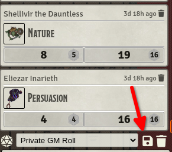
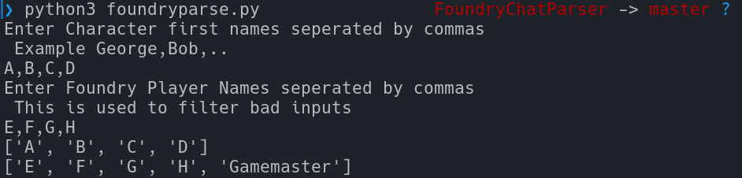

# FoundryParser
## Where to get the input text file from [FoundryVTT](https://foundryvtt.com/)  

---
## When running with Python

Text will be outputted in a file called results.txt
---
### :star: Objectives
1. Parsing [FoundryVTT](https://foundryvtt.com/) chat logs to gather stats about player rolls
2. Calculating stats for only the natural rolls
3. Returning results in a readable format
---
### :heavy_check_mark: Conditions
1. Better Rolls 5e installed, (have not tested without)
2. Better 5e Rolls using Roll20 roll settings
---
### ✖️ What it does not do
1. Calculate the unnatural rolls 
2. Handle damage rolls
3. Take advantage into account
